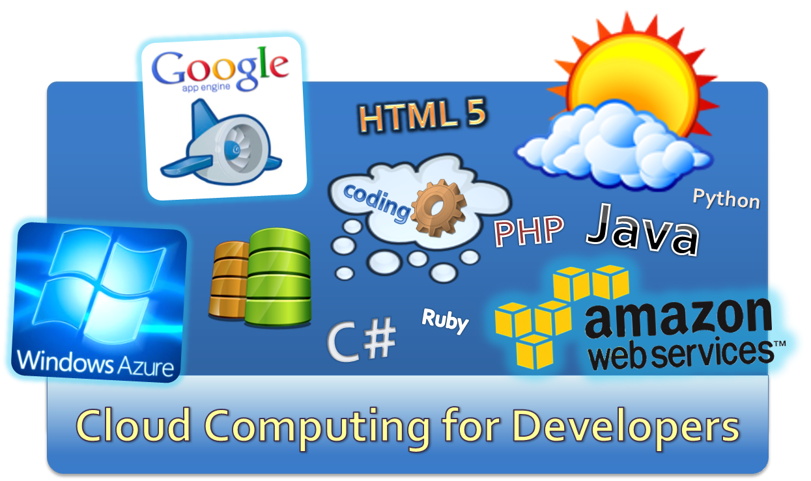
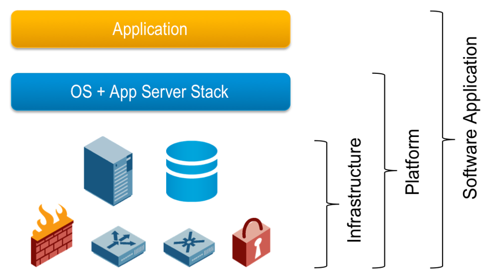
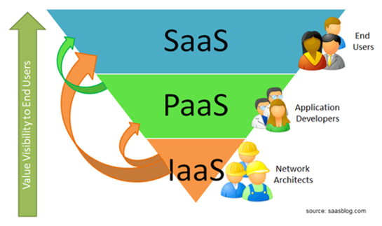
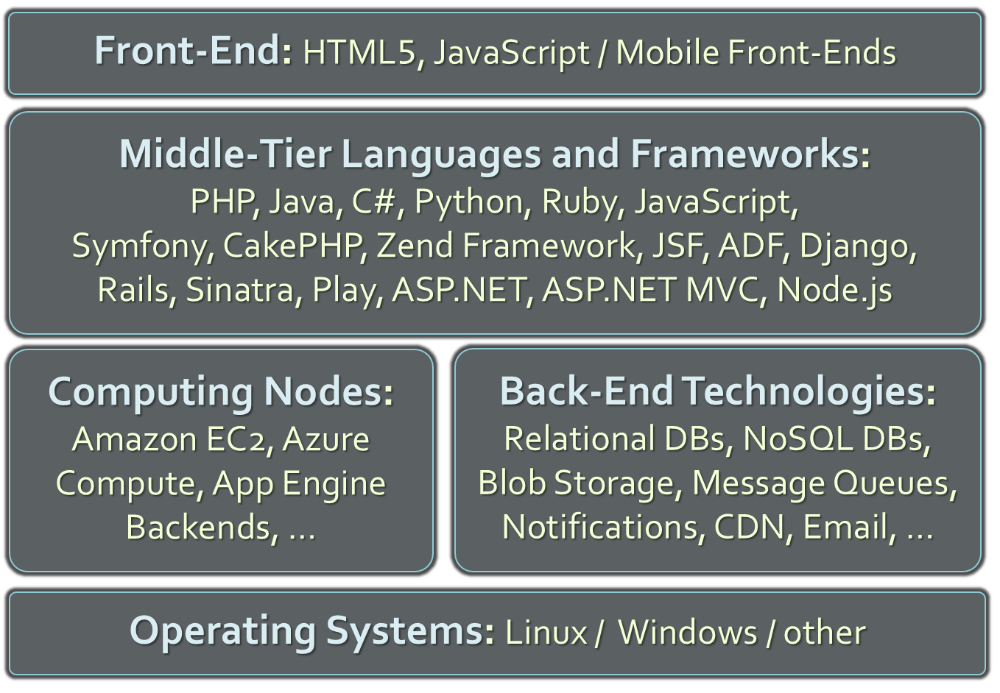
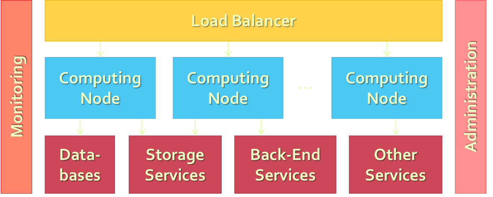
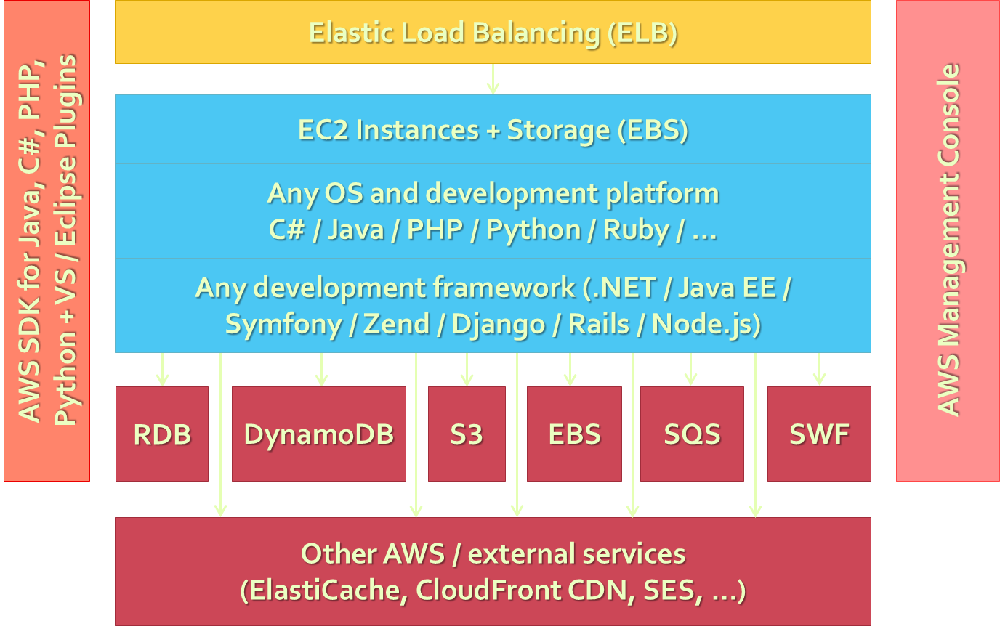
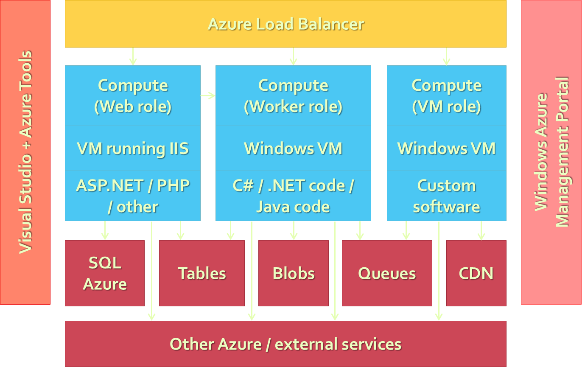
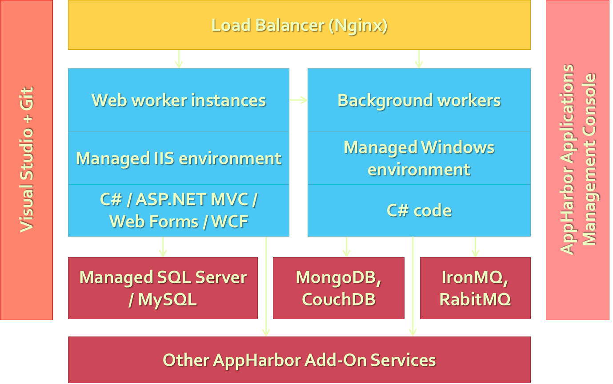

<!-- section start -->
<!-- attr: { class:'slide-title', showInPresentation:true, hasScriptWrapper:true, style:'' } -->
# Cloud Technologies and Cloud Platforms – Overview
##  Cloud: a "New" Paradigm for Developers

    
Web Services and Cloud

    
Telerik Software Academy

    <a href = "http://academy.telerik.com" class="signature-link">http://academy.telerik.com</a>

<!-- section start -->
<!-- attr: { showInPresentation:true, hasScriptWrapper:true, style:'' } -->
# Table of Contents
* The Coming of the Cloud Technologies
* What is Cloud Computing?
* Cloud Computing Models
  * IaaS
  * PaaS
    * PaaS Architecture
    * PaaS Development Stacks
    * Transition PaaS Platforms
  * SaaS

<!-- section start -->
<!-- attr: { class:'slide-section', showInPresentation:true, style:'' } -->
# The Cloud is Coming …
##  We Can’t Stop It. Better Join It!

<!-- attr: { showInPresentation:true, hasScriptWrapper:true, style:'font-size:0.8em' } -->
# Players in the Cloud Industry

<ul style="float:left; width:45%">
  <li>**Microsoft** Azure</li>
  <li>**IBM** Cloud</li>
  <li>**Apple** iCloud</li>
  <li>**Oracle** Public Cloud</li>
  <li>**SAP** NetWeaver on Demand</li>
  <li>**Google** App Engine</li>
  <li>**Amazon** Web Services</li>
  <li>**HP** Cloud Services</li>
  <li>**VMware** Cloud Foundry</li>
  <li>The **Rackspace** Cloud</li>
  <li>**Intel** Hybrid Cloud</li>
</ul>

<ul style="float:left; width:45%">
  <li>**Cisco** Cloud Applications and Services</li>
  <li>**Dell** Cloud Computing Solutions</li>
  <li>**Adobe** Creative Cloud</li>
  <li>**CA** Cloud Solutions</li>
  <li>**Symantec**.cloud services</li>
  <li>**EMC** Atmos Cloud Delivery Platform</li>
  <li>**Salesforce** Force.com Cloud Computing Platform</li>
</ul>

<!-- attr: { showInPresentation:true, hasScriptWrapper:true, style:'font-size:0.85em' } -->
# The Cloud is Everywhere!
* The **cloud technologies** are becoming inseparable part of our life:

`The cloud is here, we cannot avoid it!`

`The world is moving towards the cloud!`

* Software developers will also jump into the cloud: now or later, it will happen
  * This year, or few years later, everyone will develop applications for the cloud

<!-- attr: { showInPresentation:true, style:'font-size:0.9em' } -->
# The Cloud and Developers
* Look at the job offers in the software industry
  * Still "`cloud development experience`" is not often requirement, but it will come soon
  * Still Amazon / GAE / Azure jobs are exotic but this is changing day by day
* The new "`cloud developer`" job title is coming
  * cloud software developer 
  * cloud software engineer 
  * cloud computing engineer
  * cloud computing analyst 
  * software engineer with cloud computing 
  * cloud application developer

<!-- section start -->
<!-- attr: { class:'slide-section', showInPresentation:true, hasScriptWrapper:true, style:'' } -->
# What is Cloud Computing?

<!-- attr: { showInPresentation:true, style:'' } -->
# What is Virtualization?
* `Virtualization`
  * Running several virtual machines (virtual computers) inside a single powerful machine
    * Supported by special software called `hypervisor`
  * Uses resources more efficiently
    * E.g. 12 GB physical RAM is shared to 6 virtual machines with 4 GB shared RAM each
    * Most applications use 1-5% of the CPU
      * A single shared CPU can serve thousands of users
  * Reduces costs due to better utilization

<!-- attr: { showInPresentation:true, style:'' } -->
# What is Cloud Computing?
* `Cloud` ≈ multiple hardware machines combine their computing power and resources
  * Share them between multiple applications
  * To save costs and use resources more efficiently
* `Cloud computing environment`
  * Suppose we have `20-30` powerful machines
  * We can run `100-200` virtual machines
  * We can deploy `1'000-5'000` applications
  * We can serve `100'000-1'000'000` users

<!-- attr: { showInPresentation:true, style:'' } -->
# How the Cloud Works?
* In the cloud everyone consumes a portion of the `shared computing resources`
  * CPU, memory, storage, IO, networking, etc.
* If your business is small, you consume less
  * If your business is growing, you consume more resources from the cloud
* Pay as you go
  * Start for free, pay when you grow and need more resources

<!-- attr: { showInPresentation:true, style:'' } -->
# Cloud Computing – Example
* Suppose we have a `mail server software`
  * It needs computing resources (CPU, disk operations, networking, etc.) only when sending or receiving emails
  * The rest of the time it does nothing
* The mail server on dedicated machine will use less than `1%` of its power and resources
  * You can run `100` mail servers in the cloud for the same job on the same hardware
  * Less hardware, reduces costs, increased quality

<!-- attr: { showInPresentation:true, style:'' } -->
# Cloud == Computing Resources on Demand
* Cloud computing benefits
  * Computing on demand &rarr; pay as you go
  * Rent a hosting + CPU power + RAM + storage + IO operations + networking + other services
* Cloud has better support and reliability
  * Your data lives in a professional data center
  * Has 24 x 7 monitoring + backup + support
  * Reduces costs: rent a piece of a data center instead build you own IT infrastructure

<!-- attr: { showInPresentation:true, style:'' } -->
# Public / Private / Hybrid Cloud
* `Public clouds`
  * IT infrastructure, platform or service publicly accessible from Internet (free or paid)
* `Private clouds`
  * Cloud infrastructure (hardware + software) for internal use only, e.g. for banking / government
* `Hybrid clouds`
    * Mix of private and public cloud infrastructure and services, e.g. private cloud + backup in Amazon S3

<!-- attr: { showInPresentation:true, style:'' } -->
# Public Clouds
* `Public clouds`
  * Provide computing resources on demand
    * Publicly in Internet, for everyone
    * Paid or free of charge (to some limit)
    * Could be IaaS, PaaS, SaaS or mix of them
* Examples of public clouds
  * Amazon AWS, Google App Engine, Windows Azure, Heroku, App Fog, Rackspace, Force.com AppForce, Engineyard, AppHarbor, Apprenda, Cloud Foundry, OpenShift, CloudBees, HP Cloud, Oracle Public Cloud, Salesforce, Zoho, WordPress.com, …

<!-- section start -->
<!-- attr: { class:'slide-section', showInPresentation:true, hasScriptWrapper:true, style:'' } -->
# Cloud Computing Models <!-- .element: style="margin-top:45%" -->
##  IaaS, PaaS, SaaS

<!-- attr: { showInPresentation:true, style:'' } -->
# Cloud Computing Models
* `Infrastructure as a Service (IaaS)`
  * Virtual machines in the cloud on demand
  * Users install the OS and software they need
* `Platform as a Service (PaaS)`
  * Platform, services and APIs for developers
  * E.g. Java + JBoss + JSF + JPA + MongoDB or JavaScript + Node.js + MongoDB + RabbitMQ
* `Software as a Service (SaaS)`
  * Hosted application on demand (e.g. WordPress)

<!-- attr: { showInPresentation:true, hasScriptWrapper:true, style:'' } -->
# SaaS, PaaS and IaaS

<!-- section start -->
<!-- attr: { class:'slide-section', showInPresentation:true, hasScriptWrapper:true, style:'' } -->
# IaaS
##  Infrastructure as a Service

<!-- attr: { showInPresentation:true, style:'' } -->
# IaaS (Infrastructure as a Service)
* IaaS (Infrastructure as a Service)
  * **IaaS ≈ rent a virtual machine (VPS)**
  * You could modify your resources as you go
    * Dedicated resources + shared resources
    * E.g. add more 100 GB HDD storage + 2 GB RAM
  * Most IaaS providers give you an API for managing your cloud infrastructure
    * E.g. create a new virtual machine / allocate more resources / network config / install software / etc.

<!-- attr: { showInPresentation:true, style:'' } -->
# IaaS Pricing Models
* IaaS providers offer different **pricing models**
  * Fixed price per month for a virtual server
    * Offered by most hosting companies
  * Pricing based on computing hours
    * E.g. Amazon EC2, Rackspace Cloud Servers, Windows Azure Compute
  * Pricing per resources used. e.g.
    * E.g. $0.125 per GB storage, $0.040 per CPU hour, $0.06 per GB data transfer

<!-- section start -->
<!-- attr: { class:'slide-section', showInPresentation:true, hasScriptWrapper:true, style:'' } -->
# PaaS
##  Platform as a Service

<!-- attr: { showInPresentation:true, style:'' } -->
# PaaS (Platform as a Service)
* **PaaS ≈ rent a complete development platform**
  * Full technological stack as a service
    * E.g. Linux + Python + Django + MongoDB + cron jobs + Nginx load balancer + Gunicorn web server
  * Back-end technologies
    * E.g. relational and NoSQL DBs, blob storage, …
  * Business-tier technologies and languages
    * E.g. Java, Java EE, PHP, Python, Ruby, C#, JS
  * Frameworks: Django, Rails, Symfony, Spring, JSF

<!-- attr: { showInPresentation:true, hasScriptWrapper:true, style:'' } -->
# Typical PaaS Platform

<!-- attr: { showInPresentation:true, style:'' } -->
# Typical PaaS Services
* **Back-Ends on the Cloud**
  * Relational DBs
    * MySQL, Oracle, PostgreSQL, MS SQL Server, …
  * Non-relational DBs
    * Amazon SimpleDB, App Engine Datastore, Azure Tables, Cloudant (CouchDB + MapReduce), MongoDB, Redis, Couchbase, Cassandra
  * Blob storage / file storage
    * Amazon S3, Azure Blobs, App Engine Blobstore, Rackspace Cloud Files, Dropbox

<!-- attr: { showInPresentation:true, style:'' } -->
<!-- # Typical PaaS Services -->
* `Middle-Tier on the Cloud`
  * Computing nodes
    * Amazon EC2, Azure Compute, App Engine Backends, Rackspace Cloud Servers, …
  * Languages
    * PHP, Java, C#, Python, Ruby, JavaScript
  * Frameworks
    * Symfony, Zend Framework, JSF, ADF, Django, Rails, ASP.NET, ASP.NET MVC, Node.js

<!-- attr: { showInPresentation:true, style:'' } -->
<!-- # Typical PaaS Services -->
* `Other PaaS Services and APIs`
  * Queues
    * Amazon SQS, Google Task Queues, Azure Queues
  * Notification services
    * Amazon SNS, Windows Push Notifications, Apple Push Notification Service, PubNub
    * Email services
  * CDN (content delivery networks)
  * DNS, load balancing, quality of services, logging, monitoring, … and many others

<!-- attr: { showInPresentation:true, hasScriptWrapper:true, style:'font-size:0.85em' } -->
# Typical PaaS Architecture
* The typical cloud architecture is `multi-tier`, `SOA`, `highly-scalable` and `highly-available`

* At each tier different managed services, technologies and languages can run

<!-- attr: { hasScriptWrapper:true } -->
# AWS Architecture

<!-- attr: { hasScriptWrapper:true } -->
# Windows Azure Architecture

<!-- attr: { hasScriptWrapper:true } -->
# AppHarbor Architecture

<!-- attr: { showInPresentation:true, style:'font-size:0.9em' } -->
# Classical PaaS Stacks
* Java + JBoss app server + Java ServerFaces + JBoss Rich Faces + Java Persistence API + Oracle database
* Python + Django + MongoDB + Linux cron jobs + Nginx load balancer + Gunicorn web server
* .NET Framework + C# + ASP.NET + WCF + SQL Server + Nginx load balancer + IIS web server
* PHP + Zend Framework + Cassandra DB + Nginx load balancer + Apache web server
* JavaScript + Node.js + MongoDB + RabbitMQ
* Ruby + Ruby on Rails + MySQL + Sphinx + Memcache + Unicorn HTTP server

<!-- attr: { showInPresentation:true, style:'font-size:0.9em' } -->
# Proprietary PaaS Stacks
* `Amazon Web Services (AWS)`
  * PHP + Amazon EC2 + Linux + Apache + Amazon DynamoDB + Amazon S3 + Amazon Block Store (EBS)
  * Java + Amazon EC2 + Tomcat + Spring + Hibernate + JavaServer Faces (JSF) + Amazon RDS (Oracle)
* `Windows Azure`
  * C# + Windows Azure Compute + WCF + ASP.NET MVC + Azure Tables + SQL Azure + Azure Blobs + Azure CDN
* `Google App Engine (GAE)`
  * Java + App Engine Backends + App Engine Datastore + JPA + Google Cloud Storage + JSF + Memcache

<!-- attr: { class:'slide-section', showInPresentation:true, hasScriptWrapper:true, style:'' } -->
# Cloud Development
##  Challenges for Cloud Developers

<!-- attr: { showInPresentation:true, style:'' } -->
# What is Cloud Development?
* `Cloud software development`
  * Design and develop an application for the cloud
  * Especially for the public PaaS cloud platforms
* Typical steps in cloud software development
  * Choose  a development stack of technologies
  * Choose a cloud platform + services
  * Design the application for the cloud
  * Develop the application using the cloud APIs
  * Deploy and run the application in the cloud

<!-- attr: { showInPresentation:true, style:'' } -->
# Transition to Cloud Development
* Transition to cloud development
  * New architecture (based on SOA)
  * New programming paradigms
    * E.g. NoSQL databases
  * New APIs
    * E.g. Amazon S3, Azure Blobs, App Engine Datastore
  * New deployment model
    * Git + vendor-specific continuous integration process

<!-- section start -->
<!-- attr: { class:'slide-section', showInPresentation:true, hasScriptWrapper:true, style:'' } -->
# SaaS
##  Software as a Service

<!-- attr: { showInPresentation:true, style:'' } -->
# SaaS (Software as a Service)
* **SaaS ≈ rent an application in the cloud**
  * Fully managed application
* Examples of public SaaS services
  * **WordPress.com** – hosting of WordPress sites
  * **Basecamp** – web-based project management and team collaboration
  * **Salesforce.com** – CRM on demand
  * **Adobe Creative Cloud** – cloud for designers and creative artists

<!-- section start -->
<!-- attr: { id:'questions', class:'slide-section', showInPresentation:true, hasScriptWrapper:true, style:'' } -->
# Questions?
##  Cloud Technologies and Cloud Platforms
[link to Telerik Academy Forum](http://telerikacademy.com/Forum/Category/58/web-services-and-cloud)

