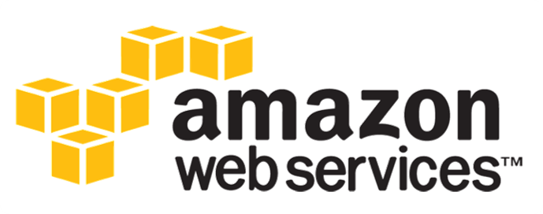
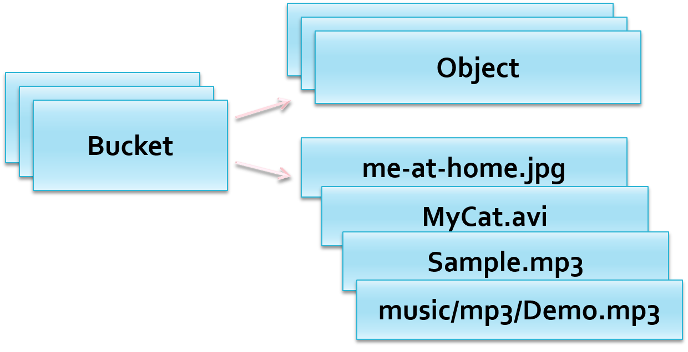
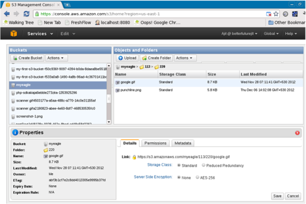
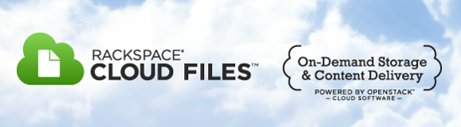
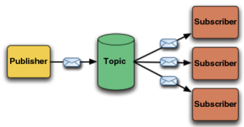
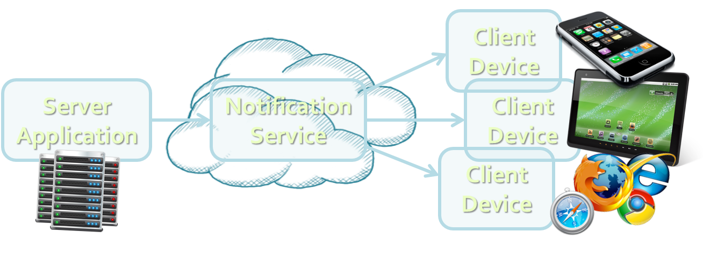

<!-- section start -->
<!-- attr: { class:'slide-title', showInPresentation:true, hasScriptWrapper:true, style:'' } -->
# Cloud Services
##  Storage, Notifications, Queues, Background Tasks, Email, CDN, Logging, Caching, MapReduce, …

    
Web Services and Cloud

    
Telerik Software Academy

    <a href = "http://academy.telerik.com" class="signature-link">http://academy.telerik.com</a>

<!-- section start -->
<!-- attr: { showInPresentation:true, hasScriptWrapper:true, style:'' } -->
# Table of Contents
* Storage Services
* Message Queues
* Notification Services
* Email Delivery
* Content Delivery Networks (CDN)
* Logging Services
* Caching Services
* Background Tasks
* MapReduce Calculations
* Other Cloud Services

<!-- section start -->
<!-- attr: { class:'slide-section', showInPresentation:true, hasScriptWrapper:true, style:'' } -->
# Cloud Storage Services
##  Introduction

<!-- attr: { showInPresentation:true, style:'' } -->
# Cloud Storage Services
* `Cloud Storage Services `are public infrastructure for storage of large objects
  * Files / blobs / images / videos / etc.
  * Stored in Internet (in a public cloud)
  * Accessible through some API (REST / SDK / etc.)
  * May have front-end for end-user access
  * Could support access control list (ACL)
  * Could be free (with limits) or paid (on-demand)
  * Could support CDN delivery or not

<!-- attr: { showInPresentation:true, hasScriptWrapper:true, style:'' } -->
# Cloud Storage Services – Examples
* Amazon S3
* Google AppEngine Blobstore
* Google Cloud Storage
* Azure Blobs
* Rackspace Cloud Files
* Google Drive, Microsoft SkyDrive, Apple iCloud
* Dropbox, Box.com, ADrive, Mozy, FlipDrive, SpiderOak, SugarSync

<!-- section start -->
<!-- attr: { class:'slide-section', showInPresentation:true, hasScriptWrapper:true, style:'' } -->
# Amazon S3
##  S3 == Simple Storage Service

<!-- attr: { showInPresentation:true, style:'' } -->
# Amazon S3
* `Amazon S3 `== Simple Storage Service
  * On-demand file storage in the AWS cloud
  * Highly-reliable (99.999999999% durability and 99.99% availability)
  * Many APIs: RESTful / SOAP / C# / Java / others
  * Two modes:
    * Normal – more reliable, more expensive
    * Reduced redundancy – cheaper, but less reliable
  * Multiple locations: US, Europe, Asia

<!-- attr: { showInPresentation:true, hasScriptWrapper:true, style:'' } -->
# Amazon S3 Concepts
* Your cloud storage consists of `buckets`
  * `Objects` are stored in the buckets

<!-- attr: { showInPresentation:true, hasScriptWrapper:true, style:'' } -->
# Amazon S3 in AWS Console

<!-- section start -->
<!-- attr: { class:'slide-section', showInPresentation:true, hasScriptWrapper:true, style:'font-size:0.9em' } -->
# Rackspace Cloud Files
##  File Storage in the Cloud Served through a CDN 

<!-- attr: { showInPresentation:true, style:'' } -->
# Rackspace Cloud Files
* Rackspace Cloud Files
  * Cloud storage service by Rackspace
  * Can use Akamai CDN
* RESTful API / Java API / C# API / PHP API / …
* Main operations
  * List containers, list objects, CRUD for objects
* Pricing (as of November 2015)
  * On-demand: $0.10 / GB per month
  * Akamai CDN: $0.12 / GB

<!-- section start -->
<!-- attr: { class:'slide-section', showInPresentation:true, hasScriptWrapper:true, style:'font-size:0.9em' } -->
# Dropbox
##  Cloud Storage with Auto Sync for Any DeviceAccessible through REST / Java / C# APIs

<!-- attr: { showInPresentation:true, style:'' } -->
# Dropbox
* Dropbox
  * File storage in the Dropbox cloud
  * 2 GB free + bonus storage (up to 18 GB)
  * Auto-sync for any device / OS
    * Windows, Mac OS X, Linux
    * iPhone, iPad, Android
  * Accessible through REST / Java / C# APIs
    * http://www.dropbox.com/developers/reference/sdk

<!-- attr: { class:'slide-section demo', showInPresentation:true, hasScriptWrapper:true, style:'' } -->
<!-- # Accessing Dropbox from .NET through OAuth -->
##  [Demo]()

<!-- section start -->
<!-- attr: { class:'slide-section', showInPresentation:true, hasScriptWrapper:true, style:'' } -->
# Queues in the Cloud
##  Message Queues,Publish-Subscribe Model,Asynchronous Messaging

<!-- attr: { showInPresentation:true, hasScriptWrapper:true, style:'' } -->
# Queues and Messaging
* `Message queues `are mechanism for asynchronous message delivery
  * `Publish-subscribemodel`
  * `Topics` are availablefor subscription
    * Also known as `message channels`
  * `Publishers `send messages to some topic
  * `Subscribers` receive messages asynchronously

<!-- attr: { showInPresentation:true, style:'' } -->
# Message Queue Cloud Services
* Many public cloud platforms provide `message queue services `in the cloud
  * `IronMQ `– [iron.io/mq](http://www.iron.io/mq)
    * Has free and paid plans (no credit card required)
    * Supports all major languages (C#, Java, PHP, …)
  * `CloudAMQP `– [cloudamqp.com](http://www.cloudamqp.com/)
    * RabbitMQ as a service (has free and paid plans)
    * Supports all major languages (C#, Java, PHP, …)
  * Amazon SQS – paid service (free trial)
  * Azure Queue Service – paid service (free trial)

<!-- attr: { class:'slide-section demo', showInPresentation:true, hasScriptWrapper:true, style:'' } -->
<!-- # IronMQ -->
##  [Demo]()

<!-- section start -->
<!-- attr: { class:'slide-section', showInPresentation:true, hasScriptWrapper:true, style:'' } -->
# Notification Services
##  Push Notifications in the Cloud

<!-- attr: { showInPresentation:true, hasScriptWrapper:true, style:'' } -->
# Push Notifications
* What does "push notifications" mean?
  * `Push notifications `are a mechanism to instantly deliver asynchronously messages
  * To subscribed client applications or devices
  * E.g. iPhone app / Android app / Windows 8 app / JavaScript Web app (HTML5)

<!-- attr: { showInPresentation:true, style:'font-size:0.95em' } -->
# Cloud Notification Services
* `Apple Push Notification Service `(APNS)
  * Delivers push notifications for iOS (iPhone / iPad)
  * A `free` public service hosted by Apple in their cloud
  * Accessed through TCP socket to gateway.push.apple.com:2195 (over TLS)
* `Windows Push Notification Services `(WNS)
  * Delivers push notifications for  Windows 8 devices
  * A `free` public service hosted by MS in their cloud
  * Accessed though HTTPS connection to https://db3.notify.windows.com

<!-- attr: { showInPresentation:true, style:'' } -->
<!-- # Cloud Notification Services -->
* `Android Cloud to Device Messaging `Framework (C2DM)
  * Push notification service for Android devices
    * Similar to iOS APNS and Win8 WNS
  * Hosted by Google in their cloud, free
* `Google AppEngine Channel API`
  * Push notifications to JavaScript applications
  * Standard service in Google AppEngine (GAE)
  * Has Java and Python API (no C# / PHP / Ruby)

<!-- attr: { showInPresentation:true, hasScriptWrapper:true, style:'font-size:0.9em' } -->
# Cross-Platform Push Notifications
* `Cross-platform push notification clouds `unify the push messaging across platforms  and devices
  * Send push messages through any language (like C#, Java and PHP)
  * Receive the messages in any device / app
    * iOS, Android, WP7, Windows 8, JavaScript
* PubNub – [www.pubnub.com](http://www.pubnub.com/)
  * Has free and paid subscriptions
  * SDK for C# / Java / PHP / …
  * Client for iOS, Android, WP7, HTML5, Flash

<!-- attr: { class:'slide-section demo', showInPresentation:true, hasScriptWrapper:true, style:'' } -->
<!-- # PubNub -->
##  [Demo]()

<!-- section start -->
<!-- attr: { class:'slide-section', showInPresentation:true, hasScriptWrapper:true, style:'font-size:0.9em' } -->
# Email Delivery Services
##  Send / Receive Email Services for Cloud Apps

<!-- attr: { showInPresentation:true, hasScriptWrapper:true, style:'' } -->
# Email Delivery Cloud Services
* Many email delivery cloud services are provided as add-ons in most public clouds
  * Mailgun
    * Send / receive emails (POP3 and IMAP inboxes)
    * Free 300 emails per day + paid plans
  * SendGrid
    * Email delivery + analytics
    * Free 200 emails per day + paid plans
  * CloudMailIn
    * Incoming emails to HTTP hook

<!-- section start -->
<!-- attr: { class:'slide-section', showInPresentation:true, hasScriptWrapper:true, style:'font-size:0.9em' } -->
# Content Delivery Networks (CDN)
##  Fast Deliver Content from Multiple Geo-Locations

<!-- attr: { showInPresentation:true, style:'' } -->
# Content Delivery Networks
* `Content Delivery Networks `(CDN) are content-storage and distribution networks
  * Speed-up access to files / images / videos
  * Reduce the load of a central server
  * Mirror the content across many nodes in different geo-locations (e.g. one per region)
  * Each node keeps a cached copy of the most-requested files
  * Could host public and private files
  * Usually provides SCP / FTP file access + API

<!-- attr: { showInPresentation:true, style:'' } -->
# Cloud CDN Services
* `Akamai CDN `– www.akamai.com 
  * The largest and most mature CDN (leader)
  * Pricing
    * ~ $0.40/GB, less for high volume
* `Rackspace Cloud Files`
  * Cloud storage + CND (based on Akamai)
  * Pricing (as of June 2012)
    * ~ $0.10/GB/month for the storage
    * ~ $0.40/GB for the traffic in the CDN

<!-- attr: { showInPresentation:true, style:'' } -->
# Cloud CDN Services (2)
* `Amazon` `CloudFront CDN`
  * Used as extra to Amazon S3 and EC2
  * Costs ~ $0.12/GB – $0.25/GB for the traffic
* `Windows` `Azure` `CDN`
  * Used as extra for the Windows Azure Storage
  * Charges ~ $0.12 /GB for US to Europe transfers
* `MaxCDN `– www.maxcdn.com
  * Seems less expensive
  * ~ $0.02/GB-$0.07/GB (min 1 TB traffic for $40)

<!-- section start -->
<!-- attr: { class:'slide-section', showInPresentation:true, hasScriptWrapper:true, style:'' } -->
# Logging Services
##  Log Management, Analytics, Alerts, Etc. 

<!-- attr: { showInPresentation:true, style:'' } -->
# What is Logging?
* `Logging` is chronological and systematic record of data processing events in a program
  * E.g. the Windows Event Log, Apache access log
* Logs can be saved to a persistent medium (locally or in the cloud) to be analyzed later
* Cloud logging services usually provide:
  * Storage of logs messages
  * Analytics (find / explore / visualize)
  * Alerts (e.g. send email / SMS on certain errors)

<!-- attr: { showInPresentation:true, hasScriptWrapper:true, style:'' } -->
# Cloud Logging Services
* Logentries – logentries.com 
  * Real-time logging service
  * Log analysis & visualization, events tracking
  * Free plan: 1 GB log / month, 1 week analytics
* Loggly – loggly.com 
  * System monitoring and alerting
  * Application intelligence (analytics)
  * RESTful API + libraries for Java, C#, PHP, …
  * Free plan: 200 MB log + 1 week analytics

<!-- section start -->
<!-- attr: { class:'slide-section', showInPresentation:true, hasScriptWrapper:true, style:'' } -->
# Caching Services
##  Caching Data for Faster Subsequent Access

<!-- attr: { showInPresentation:true, style:'' } -->
# Caching Services
* `Caching `means to store data in memory or in other fast storage for faster later access
  * E.g. instead of building a Web page (3-4 SQL queries + some processing), get it from the cache
  * The cache holds data objects (key-value pairs)
  * Cached data has expiration (e.g. 5 minutes)
* Usually `runs locally` in the cloud provider
  * AppHarbor runs Membase Memcached Server
  * Heroku runs Memcached Server (Couchbase)
  * Free plans (5 MB) + paid plans

<!-- attr: { showInPresentation:true, style:'' } -->
# Cloud Caching Services
* AppHarbor Memcacher
  * Accessed through Enyim MemcachedClient
  * 5 MB free cache storage + paid plans
* Heroku Memcache
  * Accessed through client libraries: MemcachedClient for Java / Python / Ruby
  * 5 MB free cache storage + paid plans
* MemCachier for Heroku – memcachier.com
  * 25 MB free cache + paid plans

<!-- section start -->
<!-- attr: { class:'slide-section', showInPresentation:true, hasScriptWrapper:true, style:'' } -->
# Background Tasks
##  Run Background Server-Side Logic

<!-- attr: { showInPresentation:true, style:'' } -->
# Background Tasks in the Cloud
* Google AppEngine Task Queue API
  * Perform work as background processing
  * Based on URL invocation with parameters
  * GAE asynchronously executes HTTP post to a preconfigured URL for each task in the task queue
* Heroku Scheduler
  * Runs tasks on certain time (e.g. 10 minutes)
* Heroku Cron
  * Daily Cron – runs a task once daily (free)
  * Hourly Cron – runs a task every hour (paid)

<!-- attr: { class:'slide-section', showInPresentation:true, hasScriptWrapper:true, style:'' } -->
 MapReduce Calculations
##  Distributing Large Calculations on Multiple Machines

<!-- attr: { showInPresentation:true, style:'' } -->
 What is MapReduce?
* MapReduce is distributed calculation paradigm
  * Splits a long calculation to multiple nodes
  * The results is calculated many times faster
  * The consumed resources are many times more
* Application of "map reduce"
  * For time-consuming computational tasks
    * E.g. encoding a video, data compression, generating a very complex report
* MapReduce infrastructure is provided as service in many public clouds

<!-- attr: { showInPresentation:true, style:'' } -->
 MapReduce in the Public Clouds
* Amazon Elastic MapReduce (Amazon EMR)
  * MapReduce API running in the AWS infrastructure – uses EC2 and S3
  * Cost = EMR price + EC2 price + S3 price
* Google AppEngine MapReduce Service
  * Has Python and Java APIs
  * Priced like usual GAE computing instances

<!-- attr: { class:'slide-section', showInPresentation:true, hasScriptWrapper:true, style:'' } -->
 Other Cloud Services

<!-- attr: { showInPresentation:true, style:'' } -->
 Other Cloud Services
* The best way to learn about the other public cloud services is to explore the
  * Add-Ons Directory on Heroku
  * https://addons.heroku.com
  * A really large list of cloud add-ons

<!-- section start -->
<!-- attr: { class:'slide-section', showInPresentation:true, style:'' } -->
# Questions?
## Other Cloud Services
[link to Telerik Academy Forum](http://telerikacademy.com/Forum/Category/58/web-services-and-cloud)